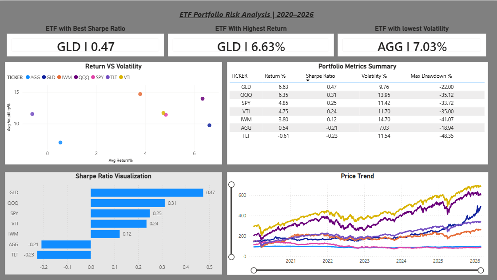

# ETF Portfolio Risk Analysis Pipeline

An end-to-end automated data engineering pipeline that downloads daily
ETF price data, loads it into a cloud data warehouse, transforms it
with dbt, and visualizes portfolio risk metrics in Power BI.



---

## Architecture

yfinance API --> AWS S3 --> Snowflake --> dbt --> Power BI

Apache Airflow (orchestrates everything daily at 8:00 AM)

---

## Tech Stack

| Layer          | Tool                        |
|----------------|-----------------------------|
| Orchestration  | Apache Airflow (Ubuntu/WSL) |
| Data Source    | yfinance (Python)           |
| Cloud Storage  | AWS S3                      |
| Data Warehouse | Snowflake                   |
| Transformation | dbt (data build tool)       |
| Visualization  | Microsoft Power BI          |

---

## ETFs Tracked

AGG, GLD, IWM, QQQ, SPY, TLT, VTI

5 years of daily closing prices — 1,548 trading days per ticker.

---

## Key Metrics Produced

- Sharpe Ratio — risk-adjusted return per ETF
- Annualized Return % — total return over the analysis period
- Volatility % — annualized standard deviation of daily returns
- Max Drawdown — largest peak-to-trough decline

Result: GLD ranked #1 in Sharpe Ratio (0.47) across the analysis period.

---

## Repository Structure

    .
    ├── dbt/
    │   ├── models/
    │   │   ├── staging/
    │   │   │   └── stg_prices.sql              # Unpivots wide to long format
    │   │   └── marts/
    │   │       └── fct_portfolio_metrics.sql   # Calculates all risk metrics
    │   ├── dbt_project.yml
    │   └── schema.yml
    ├── airflow/
    │   ├── portfolio_pipeline.py               # Airflow DAG definition
    │   └── get_data_auto.py                    # Data download and S3 upload
    ├── .gitignore
    ├── .env.example                            # Environment variable template
    └── README.md

---

## Setup Guide

### Prerequisites

- AWS account with an S3 bucket
- Snowflake account
- Python 3.8+
- WSL and Ubuntu (Windows users)
- dbt Core installed
- Apache Airflow installed

### 1. AWS S3

Create an S3 bucket to store the raw CSV files.
Update the bucket name variable in `get_data_auto.py`.

### 2. Snowflake Setup

In Snowflake, complete the following steps in order:

- Create a database with schema: `INGEST`
- Create a Storage Integration linking Snowflake to your S3 bucket
- Create a Stage using that Storage Integration
- Create the raw table `RAW_HISTORICAL_PRICES_WIDE` to receive incoming CSV data

### 3. dbt Configuration

- Install dbt: `pip install dbt-snowflake`
- Initialize your project: `dbt init`
- Configure Snowflake credentials in `~/.dbt/profiles.yml`
- Reference `.env.example` for required variables — do not hardcode credentials

### 4. Apache Airflow (Ubuntu/WSL)

```bash
# Create and activate virtual environment
python3 -m venv ~/airflow_env
source ~/airflow_env/bin/activate

# Install Airflow and Snowflake provider
pip install apache-airflow apache-airflow-providers-snowflake

# Initialize and start Airflow
airflow db init
airflow scheduler &
airflow webserver --port 8080
- In the Airflow UI (localhost:8080), add a Snowflake connection
  named `snowflake_default` with your account credentials
- Place `portfolio_pipeline.py` and `get_data_auto.py`
  in your `~/airflow/dags/` directory

### 5. Power BI

- Open Power BI Desktop, navigate to Get Data, and select Snowflake
- Connect to `PORTFOLIO_DB` > `INGEST` > `FCT_PORTFOLIO_METRICS`
- Also load `PORTFOLIO_DB` > `INGEST` > `RAW_HISTORICAL_PRICES_WIDE` for price trend visuals
- Set a scheduled refresh to run daily after the 8:00 AM pipeline completes

---

## Dashboard Visuals

- KPI Cards — Best Sharpe ETF, Highest Return ETF, Lowest Volatility ETF
- Bar Chart — Sharpe Ratio by ticker
- Scatter Plot — Return vs. Volatility (risk/reward quadrant)
- Line Chart — Cumulative price trends (2020 to 2026)
- Metrics Table — All 7 ETFs with full metrics side by side

---

## Security

- No credentials are hardcoded anywhere in this repository
- Snowflake connects to S3 via a Storage Integration (IAM-based, no access keys)
- All secrets are managed via environment variables (see `.env.example`)

---

## Author

Malhar Mardikar
https://www.linkedin.com/in/malhar-mardikar-768892287/
